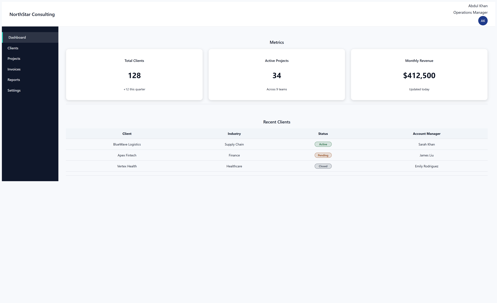

# Internal Client Management Portal (HTML + CSS)

A clean, enterprise-style internal dashboard built using **semantic HTML** and a **scalable CSS architecture**.

This project focuses on:

- Layout ownership (Grid / Flex)
- Design tokens via CSS variables
- `currentColor`-driven UI states
- Clean, maintainable CSS structure

---

## 🔍 Preview

---

## 🚀 Live Demo

👉 **GitHub Pages:**  
https://waheedkhan10001.github.io/internal-client-management-portal/

---

## 📁 Project Structure

/
├── index.html # Semantic HTML structure

├── style.css # Design tokens, layout & component styles

├── screenshot.png # UI preview for README

├── README.md # Project documentation

├── LICENSE # MIT License

---

## 🧱 Tech Stack

- HTML5 (semantic & accessible)
- CSS3 (Grid, Flexbox, variables)
- No frameworks
- No JavaScript

---

## 🎯 Key Features

- Sidebar navigation with active & hover states
- Metrics dashboard with responsive grid
- Accessible data table with status pills
- Token-based theming (easy to extend)
- Clean separation of layout vs component styling

---

## 📐 Design Principles Used

- Parent owns layout & spacing
- Components own their appearance
- No magic values
- No over-scoped selectors
- Effects derived from `currentColor`

---

## 📄 License

This project is licensed under the **MIT License**.  
See the [LICENSE](./LICENSE) file for details.

---

## 👤 Author

**Abdul Waheed Khan**  
Frontend / Full-Stack Engineer (in progress 🚀)
